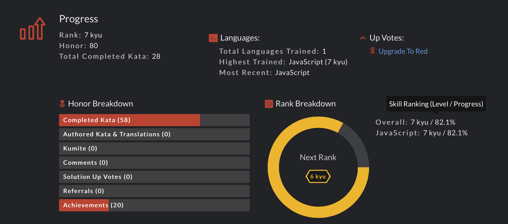
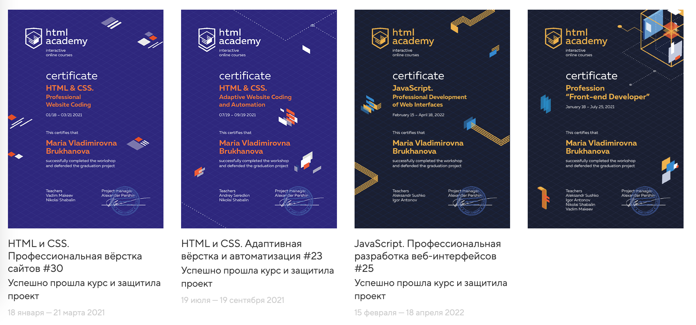
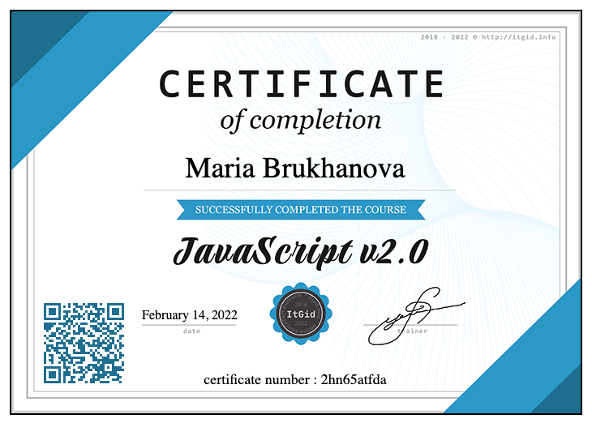

<p id="start"></p>

## Maria Brukhanova
---

### Contacts:

* phone: __79019028892__
* mail: __mbrus88@gmail.com__
* git: __riomaria__
* discord: __riomaria__

---

### Skills:
* HTML, CSS
* SCSS / LESS
* Figma / Photoshop 
* Git
* BEM
* Gulp: 
  * write/fix tasks
  * build project
* JS
  * basic methods
  * basic tasks at codewars
  

---

### Code Example: 
```
function DNAtoRNA(dna) {
  let str = '';
  for (let i = 0; i < dna.length; i++) {
    if (dna[i] === 'T') {
      str += 'U'
    } else {
      str += dna[i];
    }
  }
  return str;
}
```

### Project: 
* __training__:
  * [Keksobooking](https://riomaria.github.io/351483-keksobooking-25/)
  
* __own__: 
  * [Photographer's portfolio](https://nagrechishkina.com)
---

### Courses: 
* __completed__:
  * [HTMLacademy](https://htmlacademy.ru): HTML & CSS. Professional Websity Coding
  * [HTMLacademy](https://htmlacademy.ru): HTML & CSS. Adaptive Website Coding and Automation 
  * [HTMLacademy](https://htmlacademy.ru): JavaScript. Professional Development of Web Interfaces
  * [ItGid.info](https://itgid.info): Javascript 2.0

* __in progress__: 
  * [ItGid.info](https://itgid.info): Methods in JS, Function in Js
  * [RSShool](https://rollingscopes.com): JavaScript/Front-end Course. Stage 0

---

### Sertificates: 
* 
* 

---

### Languages
* Russian - Native
* English - Elementary

---
[Up](#start)
